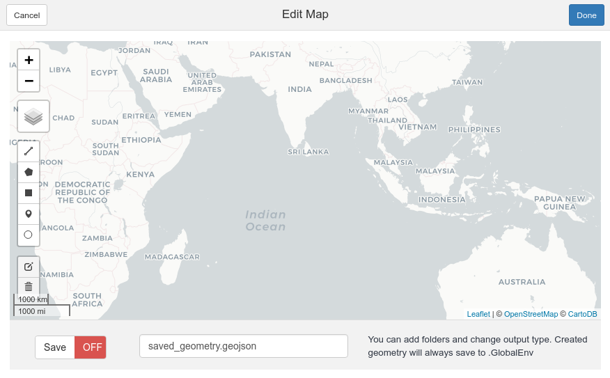
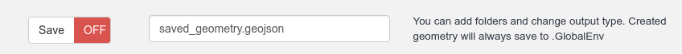

<!-- README.md is generated from README.Rmd. Please edit that file -->
mapedit.addin
=============

[](https://www.tidyverse.org/lifecycle/#experimental)

The goal of `mapedit.addin` is to simplify the creation of spatial data by wrapping the `mapedit` package. As you can see in the code below the `mapedit` package already makes the process very simple.

``` r
library(mapview)
library(mapedit)

new_spatial_data <- mapview() %>%
  editMap()
```

All `mappedit.addin` does is wrap this piece of code in an `RStudio` addin. This means that the process of creating spatial data and saving it to file is completed using only GUI tools. It is also possible to link `mapedit.addin` to keyboard shortcuts, further simplifying the process (see [here](https://rstudio.github.io/rstudioaddins/#keyboard-shorcuts)).

Installation
------------

You can install the current version of `mapedit.addin` from [Github](https://github.com/mrjoh3/mapedit.addin) with:

``` r
devtools::install_github("mrjoh3/mapedit.addin")
```

Usage
-----

This simple addin allows you to interactively create an `sf` spatial object that can then be saved and used in your code. To use, just open the addin add some geometry to the map and click `Done` when completed.



Selecting text within the `RStudio` IDE will modify the behaviour of the addin. Where no text is selected the addin will save an `sf` object called `geom` into `.GlobalEnv`. To save a spatial object to file, the `Save` switch must be toggled using the addin interface. A file called `saved_geometry.geojson` will be created in the current working directory. If text is selected in `RStudio` this will be used for naming both the `sf` object and the created file.

Adding objects to the map
-------------------------

If the text selected in `RStudio` IDE is the name of an existing `sf` object then the addin will add this object to the `mapedit` map and zoom to its bounds. When a spatial object is passed to the map in this way, any new geometry is added to it using [rbind](https://r-spatial.github.io/sf/reference/bind.html). It is not currently possible to edit existing geometry.

Saving to File
--------------

Spatial objects are saved to file using `sf::write_sf`. File names can be set by selecting text inside `RStudio` or via the naming bar at the bottom of the addin. The file naming bar can also be used to add file paths and to change output extensions.



The text seen in the naming bar is passed directly to `write_sf`. Most file drivers will be quessed by the extension. See `sf::st_drivers()` or [OGR formats](https://www.gdal.org/ogr_formats.html) for details; only `.geojson` and `.shp` have been tested.

Note that the function `write_sf` is called with options `delete_layer = TRUE` and `delete_dsn = TRUE`. This means that existing files with the same name are over-written.

Future
------

Future updates will give the user more control over:

1.  the starting point of the map (currently zooms to world or input object)
2.  the name of output object (completed)
3.  filename (completed)
4.  add more option when saving to file
5.  edit existing geometry
